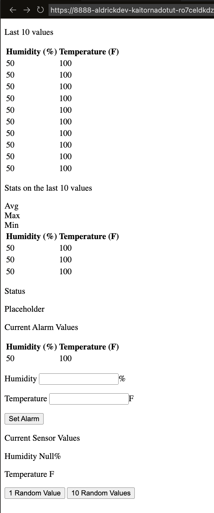

# Python Tornado Project

This gist is to go over how to setup a Tornado application to handle http request and websockets.  

## Project Finally

  

## Backend

In this section we will work on creating the backend server that will be handling all of the http requests and websocket communication to the frontend. For this, we will be using Python version 3.7.3 and the Tornado framework.  

### Backend Prep

#### Creating a Virtual Environment  

First will need to create a folder for the project. The location of mine will be in `/home/Code/TornadoProject`. In this folder I will need to create a virtual environment in order to install the necessary Python packages like Tornado.  

If you are on Windows you will need to open up your CMD or Powershell and go to the directory you created that will have your project. Once you are there, you can run `python -m venv <name of virtual environment>`.  

On Mac/Linux you can run `python3 -m venv <name of virtual environment>`  

I want my virtual environment to be called `virt` so I will run `python3 -m venv virt`.  

Once created, you should see a new directory in your projects directory with the name you entered for your virtual environment. In my case, the new directory is called `virt`.  

Now to activate the virtual environment. On Windows you would need to run `virt/Scripts/activate.bat` if using the CMD terminal or `virt/Scripts/Activate.ps1` if running Powershell. On Mac/Linux you would run `virt/bin/activate`.  

To get our our the virtual environment you can run `deactivate`.  

#### Installing Tornado  

Now that we have activated our virtual environment, we can now install the Tornado package, run `pip install tornado`. This should install tornado in our virtual environment.  

### Tornado, Hello World  

In this section we will create a simple tornado application that we will build on top of. Inside of the project directory, create a file called `main.py`. In this file enter the code below:  

``` python
# imports needed for tornado
from tornado import web
from tornado import ioloop


# Function that will return the created server
def create_server():
    # list of all of the handlers
    handlers = [
            (r"/", MainHandler)
        ]
    # returns the server
    return web.Application(handlers)


# Creating a handler for the path '/'
class MainHandler(web.RequestHandler):
    # Creating function to handle the GET request type
    def get(self):
        # returns hello world
        self.write("Hello World")
        

# Entrypoint
if __name__ == '__main__':
    # Creates server and assigns it to the server variable 
    server = create_server()
    
    # Tells the server to listen to port 8888
    server.listen(8888)
    print("Server Running")
    
    # Starts the server in an event loop
    ioloop.IOLoop.current().start()
```  

I have commented the code above but I will go over the different sections in a little more detail here.  

``` python
# imports needed for tornado
from tornado import web
from tornado import ioloop
```  

Here we are just importing 2 packages, `web` and `ioloop`.  

The `web` package will have two classes we will use, `Application` and `RequestHandler`. The `Application` class will be used to create the Tornado server and the `RequestHandler` class will be used to create a handler for when http request are received.  

The package `ioloop` will have the class `IOLoop`, which is used to start the server.  

``` python
# Function that will return the created server
def create_server():
    # list of all of the handlers
    handlers = [
            (r"/", MainHandler)
        ]
    # returns the server
    return web.Application(handlers)
```  

Here we are creating a function called `create_server` that will create the server for us. Inside the function you can see that we first create a variable called `handlers`. Inside you see a tuple `(r"/", MainHandler)`, element 0 of the tuple is `r"/"` this means that our server will accept request that hit the `/` endpoint. Element 1 of the tuple is `MainHandler`, this will handle the requests that hit `/`.  

``` python
# Creating a handler for the path '/'
class MainHandler(web.RequestHandler):
    # Creating function to handle the GET request type
    def get(self):
        # returns hello world
        self.write("Hello World")
```  

Here we create the `MainHandler` class. This is what will be handling request to reach the endpoint `/` since they are in the handlers tuple. Inside this class we create a method called `get`, this will run when the `MainHandler` needs to handle a GET request. Inside the `get` method you can see that we just run `self.write("Hello World")`.  

``` python
# Entrypoint
if __name__ == '__main__':
    # Creates server and assigns it to the server variable 
    server = create_server()
    
    # Tells the server to listen to port 8888
    server.listen(8888)
    print("Server Running")
    
    # Starts the server in an event loop
    ioloop.IOLoop.current().start()
```  

Lastly, here we have the entrypoint of the program. First we run the `create_server` function and assign that the the variable `server`. Next we tell the server to listen on port `8888`, add we then print a message that will let us know that things are working as expected. Finally, we start the server with `ioloop.IOLoop.current().start()`.  

Once you have this all typed out, you can save, then run this program with `python main.py`. Remember, you should have your virtual environment activated and have tornado installed, or this command will fail to run the code. Once you run the code, you should be able to go to your web browser and go to the url `localhost:8888`.  

  

You have created the base of this project, a simple "hello world" tornado server.  

### Rendering HTML

In this section we will look at how to get tornado to return an HTML file as a response to a request.  

First inside of the project directory, lets create a directory called `templates`, in here we will create a file called `index.html` with the following HTML in it.  

``` html
<html lang="en">
<head>
    <meta charset="UTF-8">
    <meta http-equiv="X-UA-Compatible" content="IE=edge">
    <meta name="viewport" content="width=device-width, initial-scale=1.0">
    <title>Testing</title>
</head>
<body>
    <h1>Hello World from an HTML File</h1>
</body>
</html>
```  

Now that we have our HTML file setup, let's tell our server to display it. We will need to tell our server where to find out templates (html files) and then tell the `MainHandler` to display the HTML file. The `create_server` function should look like:  

``` python
def create_server():
    # list of all of the handlers
    handlers = [
            (r"/", MainHandler)
        ]
    # Dictionary with the location of the templates directory
    settings = {
        "template_path" : Path(__file__).parent / "templates"
    }
    # returns the server
    return web.Application(handlers, **settings)
```  

Notice, now we have a dictionary called `settings` where the `template_path` is being listed with the path to the templates directory. The settings are then passed to the `web.Application` function so that the server knows where to find the templates directory.  

Now we need to update the `MainHandler` class to use the `index.html` now.  

``` python
# Creating a handler for the path '/'
class MainHandler(web.RequestHandler):
    # Creating function to handle the GET request type
    def get(self):
        # Now returns the index.html file
        self.render("index.html")
```

You can now save the `main.py` and run the script with  

``` bash
python main.py
```  

When you open your browser to `localhost:8888` you should see:  

  

The fact that you can now see `Hello World from an HTML File`, should tell you that you are pulling in the `index.html` file from the `templates` directory.  

### Styling  

Now that we can display HTML, let's style it. Create a directory called `static`, and create a file inside it called `index.css`, this is where we will add our styling. Inside of `index.css` just put:  

``` css
* {
    color: red;
}
```  

Exactly as it says, all this will do it make all of the text red. Similar to what we did for our `templates` directory, we need to tell our server that this exist. We will go back to our `settings` directory and add the static path to it.  

``` python
# function that will return the created server
def create_server():
    # list of all of the handlers
    handlers = [
            (r"/", MainHandler)
        ]
    # Dictionary listing some settings, specifically the location of the template and static files are located
    settings = {
        "template_path" : Path(__file__).parent / "templates",
        "static_path" : Path(__file__).parent / "static"
    }
    # returns the server
    return web.Application(handlers, **settings)
```  

This is what the `create_server` should look like now.  

We also need to tell the HTML file to load the styles, to do this we need to go to the `index.html` file in our `templates` directory, and add a stylesheets link to the head element. Now the `index.html` should look like:  

``` html
<html lang="en">
  <head>
    <meta charset="UTF-8" />
    <meta http-equiv="X-UA-Compatible" content="IE=edge" />
    <meta name="viewport" content="width=device-width, initial-scale=1.0" />
    <link rel="stylesheet" href="static/index.css" />
    <title>Testing</title>
  </head>
  <body>
    <h1>Hello World from an HTML File</h1>
  </body>
</html>
```  

Notice that now the head element has `<link rel="stylesheet" href="static/index.css" />` in it now, the will tell the HTML file to load in the styles found in `index.css`.  

Once all of these changes are made and you run  

``` python
python main.py
```  

The server should run and at `localhost:8888` you should see:  


If you are seeing that the text is now red, then you have properly linked the css file.  

### Full HTML

Now that we have made sure that we can render HTML and can link our CSS to it, lets add in the rest of the HTML for this project and see how that looks. Your `index.html` should now look like this:  

``` html
<!DOCTYPE html>
<html lang="en">
  <head>
    <meta charset="UTF-8" />
    <meta http-equiv="X-UA-Compatible" content="IE=edge" />
    <meta name="viewport" content="width=device-width, initial-scale=1.0" />
    <title>HTML Sensor Data</title>
  </head>
  <body>
    <div class="App">
      <div id="latest-values_container">
        <p class="panel-title">Last 10 values</p>
        <section class="content-panel border">
          <table>
            <thead>
              <tr>
                <th>Humidity (%)</th>
                <th>Temperature (F)</th>
              </tr>
            </thead>
            <tbody class="latest-values-table">
              <tr>
                <td id="hd1">50</td>
                <td id="td1">100</td>
              </tr>
              <tr>
                <td id="hd2">50</td>
                <td id="td2">100</td>
              </tr>
              <tr>
                <td id="hd3">50</td>
                <td id="td3">100</td>
              </tr>
              <tr>
                <td id="hd4">50</td>
                <td id="td4">100</td>
              </tr>
              <tr>
                <td id="hd5">50</td>
                <td id="td5">100</td>
              </tr>
              <tr>
                <td id="hd6">50</td>
                <td id="td6">100</td>
              </tr>
              <tr>
                <td id="hd7">50</td>
                <td id="td7">100</td>
              </tr>
              <tr>
                <td id="hd8">50</td>
                <td id="td8">100</td>
              </tr>
              <tr>
                <td id="hd9">50</td>
                <td id="td9">100</td>
              </tr>
              <tr>
                <td id="hd10">50</td>
                <td id="td10">100</td>
              </tr>
            </tbody>
          </table>
        </section>
      </div>
      <div id="statistics_container">
        <div class="vertical-center">
          <p class="panel-title">Stats on the last 10 values</p>
          <section class="content-panel border">
            <section id="statistic-table-title" class="margin-top">
              <div>Avg</div>
              <div>Max</div>
              <div>Min</div>
            </section>
            <section id="statistic-table">
              <table>
                <thead>
                  <tr>
                    <th>Humidity (%)</th>
                    <th>Temperature (F)</th>
                  </tr>
                </thead>
                <tbody>
                  <tr>
                    <td id="avg-hd">50</td>
                    <td id="avg-td">100</td>
                  </tr>
                  <tr>
                    <td id="max-hd">50</td>
                    <td id="max-td">100</td>
                  </tr>
                  <tr>
                    <td id="min-hd">50</td>
                    <td id="min-td">100</td>
                  </tr>
                </tbody>
              </table>
            </section>
          </section>
        </div>
      </div>
      <div id="status_container">
        <div>
          <p class="panel-title">Status</p>
          <p id="status-message" class="border">Placeholder</p>
        </div>
      </div>
      <div id="alarm_container" class="border">
        <div id="current-alarm_container">
          <p>Current Alarm Values</p>
          <table>
            <thead>
              <tr>
                <th>Humidity (%)</th>
                <th>Temperature (F)</th>
              </tr>
            </thead>
            <tbody>
              <tr>
                <td id="current-alarm-h">50</td>
                <td id="current-alarm-t">100</td>
              </tr>
            </tbody>
          </table>
        </div>
        <div id="set-alarm_container">
          <div id="humidity-alarm-input">
            <p>Humidity <input id="input-h" type="text" />%</p>
          </div>
          <div id="temperature-alarm-input">
            <p>Temperature <input id="input-t" type="text" />F</p>
          </div>
          <button id="set-alarm-button">Set Alarm</button>
        </div>
      </div>
      <div id="input_container" class="border">
        <div id="current-input-value_container">
          <p id="current-sensor-title">Current Sensor Values</p>
          <p id="sensor-title-h">
            Humidity <span id="current-sensor-h">Null</span>%
          </p>
          <p id="sensor-title-t">
            Temperature <span id="current-sensor-t"></span>F
          </p>
        </div>
        <div id="input-button_container">
          <button id="random1">1 Random Value</button>
          <button id="random10">10 Random Values</button>
        </div>
      </div>
    </div>
  </body>
</html>
```  

Now when you start the server again, you will now see this:  

  

Now yes it does look ugly but thats because it's just HTML we will add the CSS shortly.  

#### Explaining the HTML  

So that is a lot of HTML but I will attempt to go over all of the components and explain that they are for.  

This is the base of every HTML document. 

``` html
<!DOCTYPE hmtl>
<html lang="en">
  ...
</html>
``` 

<hr>  

The `head` element holds more standard metadata, but you can also see that we have a `title` element where we give our HTML document a title. 

``` html
<head>
  <meta charset="UTF-8" />
  <meta http-equiv="X-UA-Compatible" content="IE=edge" />
  <meta name="viewport" content="width=device-width, initial-scale=1.0" />
  <title>HTML Sensor Data</title>
</head>
```   

<hr>

The `body` element which is what holds eventhing that will be displayed to the user. Inside of that I put a `div` element with a class of `App`, this is where I'm putting the rest of the HTML code.  

``` html
<body>
  <div class="App">
    ...
  </div>
</body>
```  

<hr>

Inside of the `App div`, I have other `div`s, each with their own `id` assigned, this will help when I try to style the different them. The `id`s provide a way to target a specific `div`. By convention, `id's` are meant to be unique but `classes` can be shared, this will be important when styling.    

``` html
<div class="App">
  <div id="latest-values_container">
    ...
  </div>
  <div id="statistics_container">
    ...
  </div>
  <div id="status_container">
    ...
  </div>
  <div id="alarm_container">
    ...
  </div>
  <div id="input_container">
    ...
  </div>
</div>
```  

You can see that the `id`s are all unique and kind of describe what is going to be stored in it.  

<hr>

Inside the `latest-values_container div` we have a couple of different elements.  

``` html
<div id="latest-values_container">
  <p class="panel-title">Last 10 values</p>
  <section class="content-panel border">
    <table>
      <thead>
        ...
      </thead>
      <tbody class="latest-values-table">
        ...
      </tbody>
    </table>
  </section>
</div>
```  

Here you can see that we have a `p` element, this will just give us a small title for section below. You can see that it has a class `"latest-values-table"`, and what will be displayed in the UI will be `Last 10 values`.  

Below that, we have an element called `section` with multiple classes, `"content-panel"` and `"border"`. Again these are classes that I will use for styling. A `section` element is pretty much the same thing as the `div` tag.  

Inside the `section` we have a `table` element, this will allow us to create a table. In a table, you have a `thead` which would have the titles for each column and below that, you will have the `tbody` element which will hold the all of the rows for the table. I gave it the class `"latest-values-table"`.  